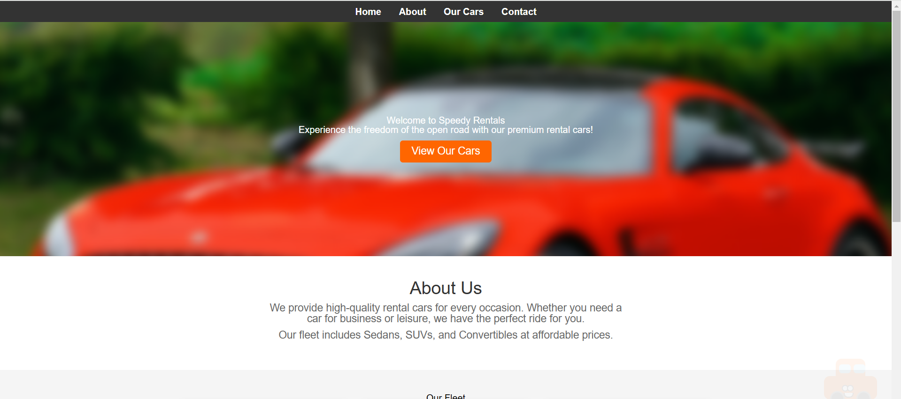
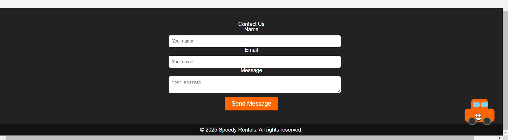

# Speedy Rentals - Car Rental Service 🚗

A responsive landing page for **Speedy Rentals**, a car rental service offering a wide range of premium vehicles. The page is built using **HTML** and **CSS** only, ensuring a fast and lightweight experience.

## 🚀 Live Demo
Check out the live version here: [Live Demo](https://tum-web-lab2-topaz.vercel.app/)

## 📸 Screenshots




## 📌 Features
- Fully **responsive** design for all screen sizes.
- **Clean and modern UI** with a focus on usability.
- **Hero section** with a call-to-action.
- **Car fleet showcase** with images and descriptions.
- **Contact form** for customer inquiries.
- **Fixed mascot helper** for assistance.

## 📁 Project Structure
```bash
/project-root
│── /images       # Images used in the website
│── index.html    # Main HTML file
│── style.css     # Stylesheet for the page
│── reset.css     # Reset CSS for consistent styling
│── README.md     # Project documentation 
```

---
**Author:** Ceban Vasile  
**Group:** FAF-223
