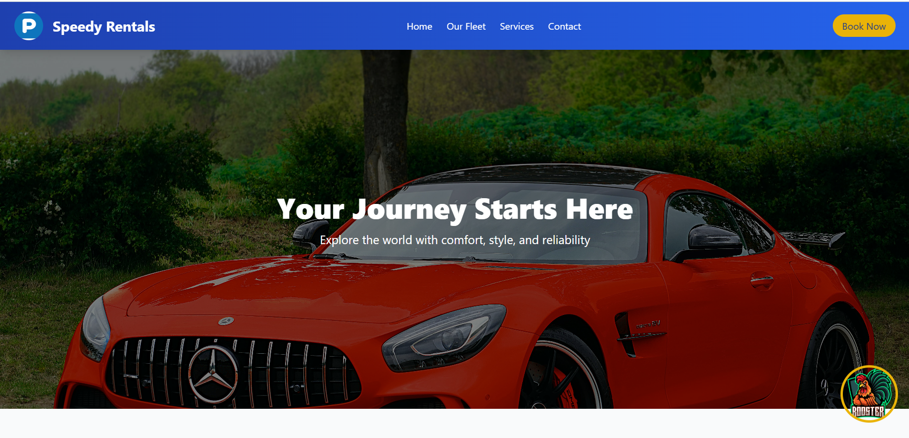

# Speedy Rentals - Car Rental Service 🚗

A responsive landing page for **Speedy Rentals**, a car rental service offering a wide range of premium vehicles. I've significantly enhanced the car rental website template with several key improvements:

Mascot Integration

Added a mascot section in the hero area with a tooltip
The mascot image has a hover effect and provides a friendly interaction point
Includes a playful tooltip explaining the mascot's role

Enhanced Navigation

Sticky top navigation with gradient background
Logo and branding element
Responsive menu with hover effects
"Book Now" call-to-action button

Improved Sections

Hero section with a more immersive background
Detailed fleet section with card-based car displays
Services section highlighting key offerings
Contact section with contact information and form
Comprehensive footer with quick links, legal information, and social media links

Design Improvements

Consistent color scheme (blue and yellow)
Responsive grid layouts
Hover and transition effects
Use of Font Awesome icons
Placeholder images for demonstration

Additional Features

Mascot tooltip interaction
Social media links
Responsive design considerations

## 🚀 Live Demo
Check out the live version here: [Live Demo](https://tum-web-lab2-topaz.vercel.app/)

## 📸 Screenshots



## 📌 Features
- Fully **responsive** design for all screen sizes.
- **Clean and modern UI** with a focus on usability.
- **Hero section** with a call-to-action.
- **Car fleet showcase** with images and descriptions.
- **Contact form** for customer inquiries.
- **Fixed mascot helper** for assistance.

## 📁 Project Structure
```bash
/project-root
│── /images       # Images used in the website
│── index.html    # Main HTML file
│── style.css     # Stylesheet for the page
│── reset.css     # Reset CSS for consistent styling
│── README.md     # Project documentation 
```

---
**Author:** Ceban Vasile  
**Group:** FAF-223
